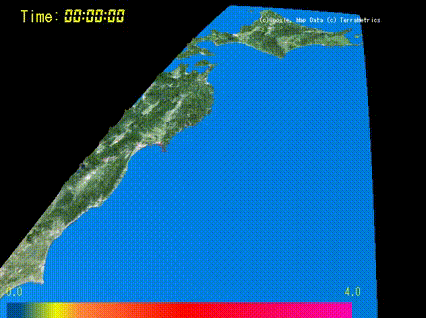
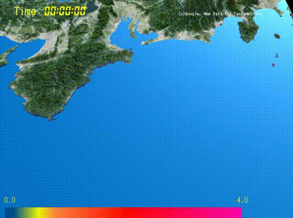
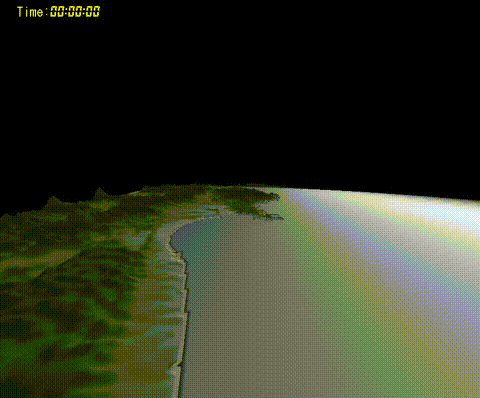
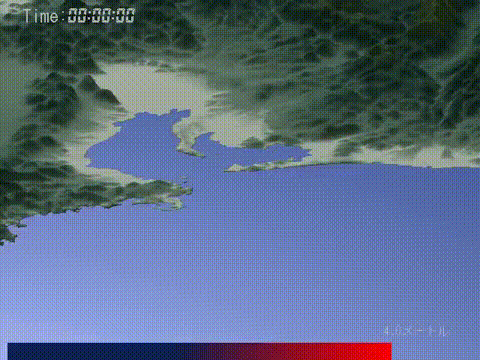
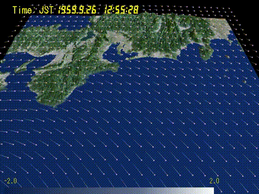
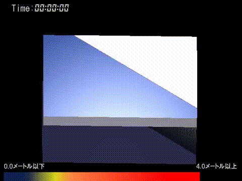
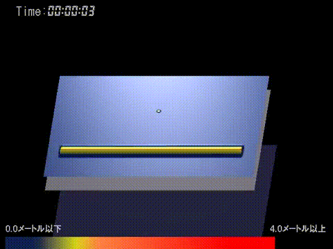

# サンプル動画  
  
## 津波シミュレーション  
  
中央防災会議CASE1_new  

 
東北大モデルVer1.2  

  
佐竹モデルVer8.0  

  
修正・宝永地震  

  
大連動ケース  

  
安政東海地震v2  

  
宝永地震v2  

  
時間差の連動  

  
東北沿岸部  

  
南海トラフ_愛知・三重沿岸  

  
## ■台風による高潮シミュレーション  
  
伊勢湾台風  

  
台風201330号(HAIYAN)  

  
## ■河川氾濫シミュレーション  
鬼怒川氾濫  

  
  
  
以下は実装時のテストに利用したデータセット  
完全反射  

  
  
離島トラップ現象  

  
#### その他のシミュレーション  
   
隕石衝突（KT_inmpact同レベル) 

  
